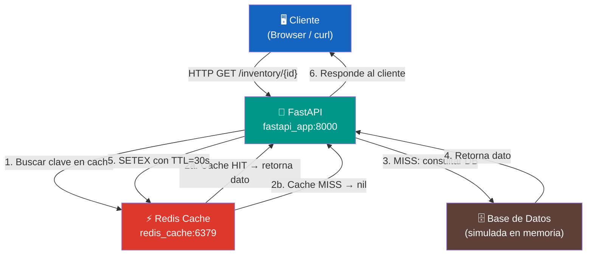
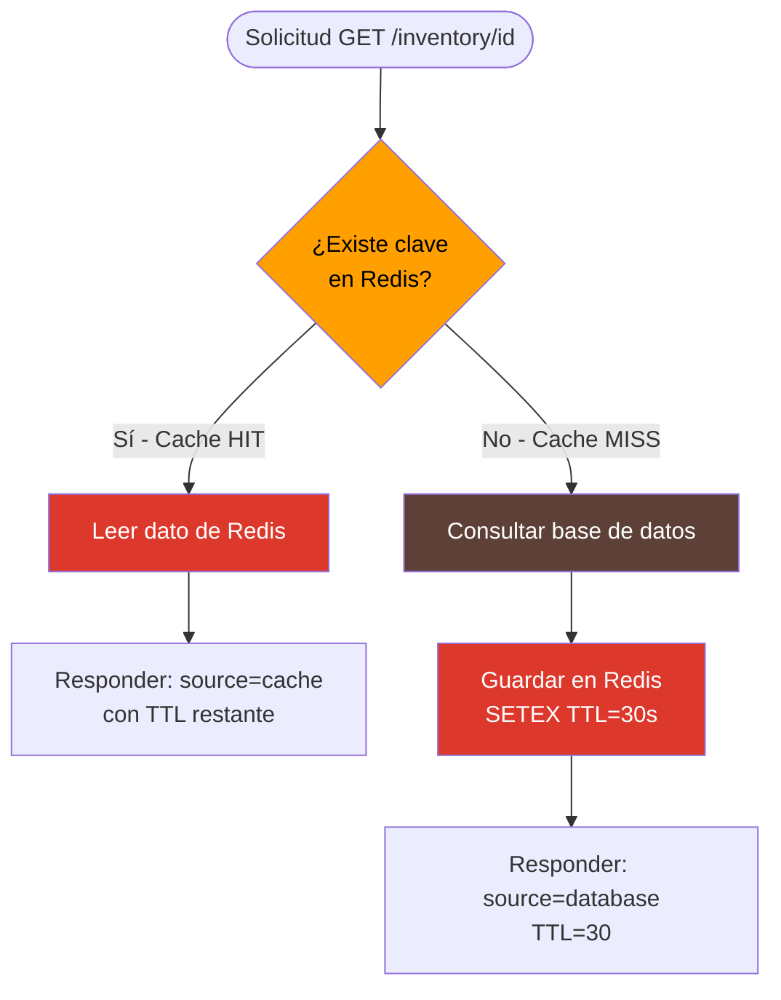
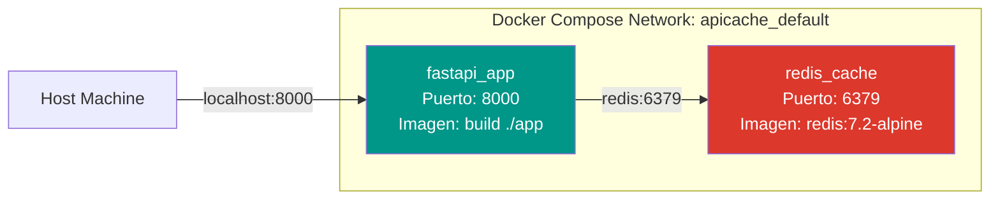

# Arquitectura del Sistema

## Diagrama de Arquitectura



---

## Diagrama de Flujo del Cache



---

## Contenedores Docker



---

## Dónde entra Redis en la arquitectura

Redis se ubica entre la API y la base de datos como una **capa de cache intermedia**. Cada vez que llega una solicitud a la API, Redis es el primer punto de consulta. Solo si Redis no tiene el dato (cache miss) se accede a la fuente de datos principal.

```
Cliente → API → Redis → (si miss) → DB
```

---

## Responsabilidad de Redis en el sistema

| Responsabilidad | Detalle |
|----------------|---------|
| **Almacenamiento temporal** | Guarda respuestas de endpoints con TTL automático de 30 segundos |
| **Reducción de latencia** | Responde en ~1ms vs ~300ms de la DB |
| **Reducción de carga** | Evita consultas repetidas a la fuente de datos principal |
| **Gestión de memoria** | Configurado con `maxmemory 128mb` y política `allkeys-lru` para evitar desbordamiento |
| **Health check** | Docker Compose verifica que Redis responda antes de iniciar la API |

---

## Stack tecnológico

| Componente | Tecnología | Versión |
|-----------|-----------|---------|
| API | FastAPI + Uvicorn | 0.111.0 |
| Cliente Redis | redis-py | 5.0.4 |
| Cache | Redis Alpine | 7.2 |
| Lenguaje | Python | 3.11 |
| Orquestación | Docker Compose | v3.9 |
